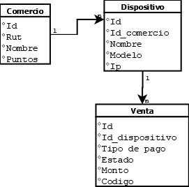

# Modelo de la base de datos



# Primeros pasos

Para el funcionamiento de la aplicación se requiere ingresar datos en primera instancia, para las tablas de "Comercio" y "Dispositivos", para así poder realizar una venta, cada enpoint está especificado por medio de un collection realizado en POSTMAN en la siguiente ruta:

```
extra/Api Haulmer.postman_collection.json
```

Tanto para las tablas de Comercio y Dispositivo se puede Insertar, modificar e eliminar por medio de sus respectivos endpoints, también por medio del collection se puede ver los parámetros aceptados, como se puede apreciar hay campos agregados que consideré pertinente para el caso tales como: 

En ventas se añadió el tipo de pago los cuáles sólo pueden ser: DEBITO,CREDITO,EFECTIVO

En ventas se añadió el campo estado los cuáles sólo pueden ser: ACEPTADA,ANULADA

# Funcionamiento 

Parte al ingresar un Comercio y crear un dispositivo vinculado a un comercio, se puede generar una venta, el cual recibe como parámetros el id del dispositivo, el tipo de pago mencionado anteriormente el estado y el monto, posterior se genera el código el cuál se realiza por medio de un hash que utiliza el id de la venta como parámetro, se almacena y realiza el aumento al comercio en puntos.

El proceso de anulado recibe como parámetro el id de la venta más el cod el cuál es el hash guardado anteriormente, se valida sí la venta que está recibiendo esta anulada y verifica sí el id de la venta más el hash coinciden, sí es correcto modifica el estado por anulado y realiza el descuento de los puntos al comercio.

# Funcionalidad Extra / Mejoras

Las mejoras fueron agregar campos que consideré necesario más la funcionalidad de realizar búsquedas de ventas en 3 endpoints diferentes

```
1) El primer endpoint permite buscar ventas por medio del tipo de pago, es decir permite la entrada de DEBITO,CREDITO,EFECTIVO
2) El segundo es similar al anterior pero esta vez realiza una búsqueda con el estado de la venta, es decir permite la entra de los estados: ACEPTADA,ANULADA
3) Y el tercero permite buscar ventas entre rangos de fecha, es decir utiliza una fecha de inicio y una fecha de termino, devolviendo las ventas que estén DENTRO del rango de esas fechas
```
